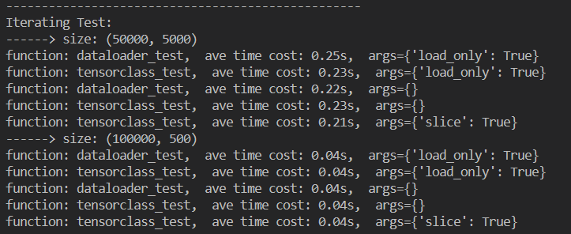
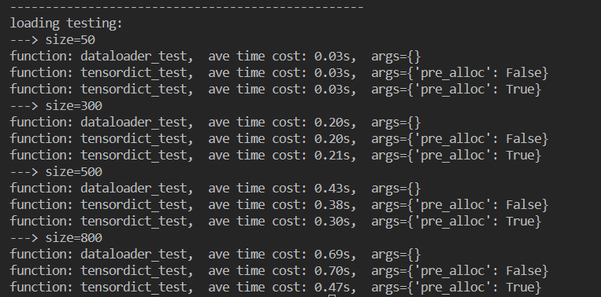

# Project

PyTorch DataLoader和TorchDict的IO性能评价

## Introduction

在分布式机器学习训练中，如何保持高效的训练数据读取是一项非常重要的课题。`PyTorch`提供了`DataLoader`来解决这个问题，但是我们在使用过程中总会觉得并不是那么高效。`TensorDict`则是给出了一个`tensorclass`的解决方案，并且看上去很promising。那么，事实真的如此吗？

## Requirement && Evaluation

### Objective

设计实验，比较`DataLoader`和`tensorclass`的性能，并进行分析。如无单机多卡的实验环境，可先实现单机单卡，然后联系[zhanghan](maito:zhanghan@higgsasset.com)安排多卡环境测试。

### Evaluation

- 完成benchmark设计并能获得基础的测试结果
- 对测试结果进行简单分析
- 实现多机多卡加分
- 规范使用`git`，规范使用`README`、`CHANGELOG`、`.gitignore`和`License`
- 代码条理清晰，且符合`PEP 8`规范

### Related Works

- [TorchDict Tutorial](https://pytorch.org/tensordict/tutorials/tensordict_memory.html)
- [PyTorch/TorchDict Intergration](https://github.com/pytorch/pytorch/pull/112441)

## Project Design

使用共同外部NDArray数据，基于相同训练函数，针对DataLoader及TensorDict分部记录运行时间并对照分析。

控制变量在不同数据量的情况下进行分析。

## Test Env & Instruction

Dependable package in `requirements.txt`.

可以使用以下命令初始化并使用名为`torch_test`的环境:

```bash
virutalenv torch_env
source ./torch_env/bin/activate
pip3 install -r requirements.txt
```

随后可以使用以下命令直接运行所有测试:

```bash
python ./main.py
```

## Test Result & Analysis

测试过程分为两部分， Iteration遍历测试和data loading预加载测试及其它小测试。

### Iteration Part

本机单卡测试基于Python3.8.7，多次运行典型测试结果如下图：



依据Iterating结果可以看出：

1. 在数据loading并进入GPU这一过程中， 作为对照组tensordict的性能与普通dataloader性能整体相差不大。
2. 考虑training时Iteration的过程，tensorclass与DataLoader的差别在于可以使用operator[]进行slice切片，但该切片功能并不能直接带来明显的性能提升。测试结果显示，使用时DataLoader时普通Dataset与tensorclass的遍历速度无明显差别，与tensorclass自带slicing的速度亦无明显差别。

### Data Loading Test

依据上述分析及对比测试，参考tensorclass文档，tensorclass可以由tensorDict无开销构造，而tensorDict支持内存预分配。此处的测试目标便是数据预分配带来的效率提升。

测试基于Python3.8.7，使用多维度数据，以某一维度的长度作为变量，对数据在维度上拼合过程进行对比。多次运行典型测试结果如下图：



依据测试结果，可以明显看出：
1. tensorDict的内存预分配在拼合数据量庞大时带来的性能提升非常明显。
2. 而拼合维度上数量较小时则没有明显的性能提升，此时内存申请耗时占比不高，预分配的优势不明显。
3. 不进行预分配时，tensorclass与DataLoader的加载速度无异，也即性能提升可以被归因于预分配。

### Other Test

除此之外，在代码编写过程中依据时间花费分析的思路进行了如下对比测试，得出一些简单结论：
1. 将data loading的目标设备设置为CPU，会发现二者在加载数据过程的时间花费均降低至为0.00s，即二者加载数据的主要时间均发生在由CPU向GPU复制数据的过程，而依据Data Loading 所得到的结论，tensorclass在该过程中可以通过预分配减少内存申请过程开销，但对复制过程无能为力。
2. 在Iteration test中测试了tensorclass单个tensor数据的两种loading方式(参见tensorclass_test中的注释部分)：tensordict预分配内存和现场直接创建obj的方式。经测试速度相同，因为仅存在单次内存分配的调用开销，印证了Data Loading test中的结论。
3. 根据上述分析，loading过程的另一处瓶颈可能存在于disk IO read的过程。但由于tensorclass文档中所述磁盘内存映射的`class MemoryMapperTensor`在当前版本的package中尚未实现无法调用，故而未进行测试。

