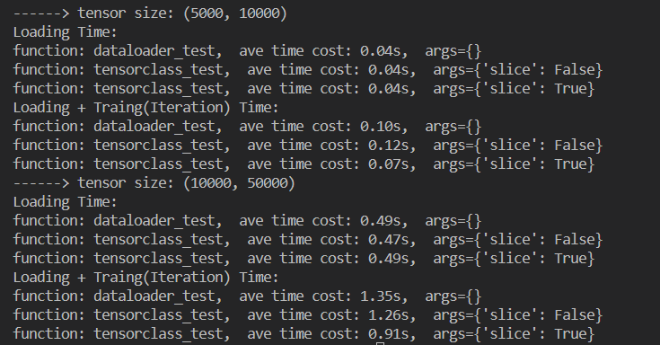

# Project

PyTorch DataLoader和TorchDict的IO性能评价

## Introduction

在分布式机器学习训练中，如何保持高效的训练数据读取是一项非常重要的课题。`PyTorch`提供了`DataLoader`来解决这个问题，但是我们在使用过程中总会觉得并不是那么高效。`TensorDict`则是给出了一个`tensorclass`的解决方案，并且看上去很promising。那么，事实真的如此吗？

## Requirement && Evaluation

### Objective

设计实验，比较`DataLoader`和`tensorclass`的性能，并进行分析。如无单机多卡的实验环境，可先实现单机单卡，然后联系[zhanghan](maito:zhanghan@higgsasset.com)安排多卡环境测试。

### Evaluation

- 完成benchmark设计并能获得基础的测试结果
- 对测试结果进行简单分析
- 实现多机多卡加分
- 规范使用`git`，规范使用`README`、`CHANGELOG`、`.gitignore`和`License`
- 代码条理清晰，且符合`PEP 8`规范

### Related Works

- [TorchDict Tutorial](https://pytorch.org/tensordict/tutorials/tensordict_memory.html)
- [PyTorch/TorchDict Intergration](https://github.com/pytorch/pytorch/pull/112441)

## Project Design

使用共同外部NDArray数据，基于相同训练函数，针对DataLoader及TensorDict分部记录运行时间并对照分析。

控制变量在不同数据量的情况下进行分析。

## 分析结果：

本机单卡多次运行，典型测试结果如图：

依据结果可以看出，在数据loading并进入GPU这一过程中， tensordict的性能显著优于普通dataloader。当数据量庞大时尤为明显。而在整体性能，也即考虑training时Iteration的过程，从tensordict中取batch数据的速度在数据量大时则显著慢于普通dataloader。

当然，对于traing Iteration部分，此测试结果并不绝对消极。 tensorclass可能存在本作者尚未发现的其它更高效的batch遍历方式，此处有待探究。 但是依照此代码中的方法进行处理时，tensorclass因batch遍历过程较慢而并不具有明显的优势。
